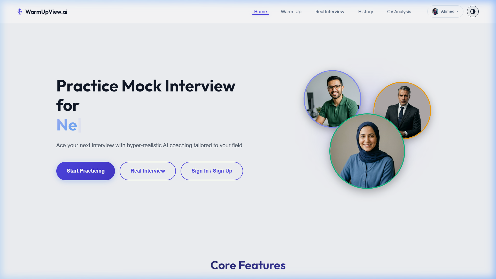
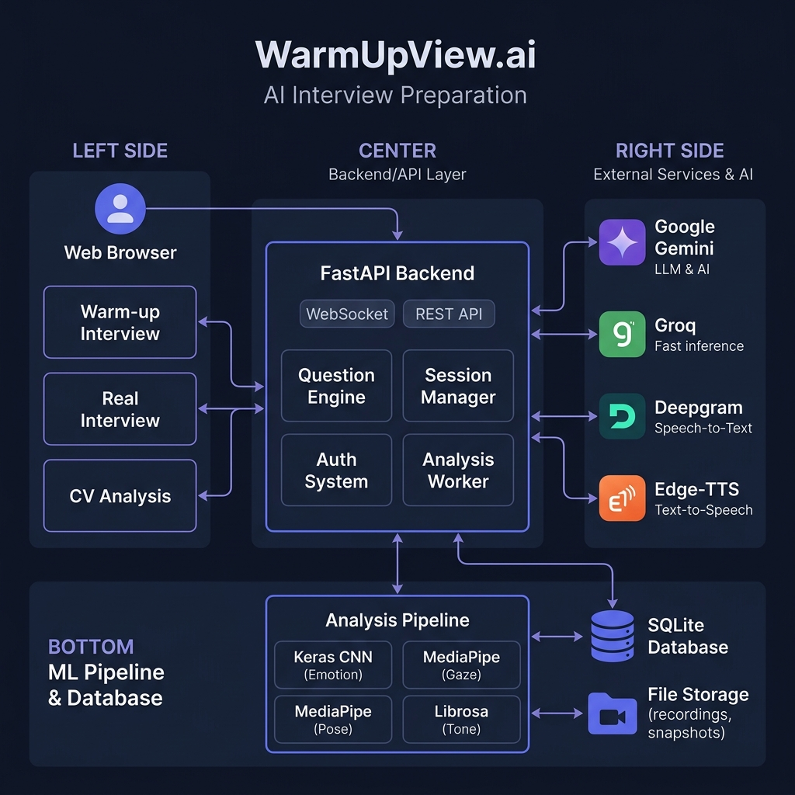
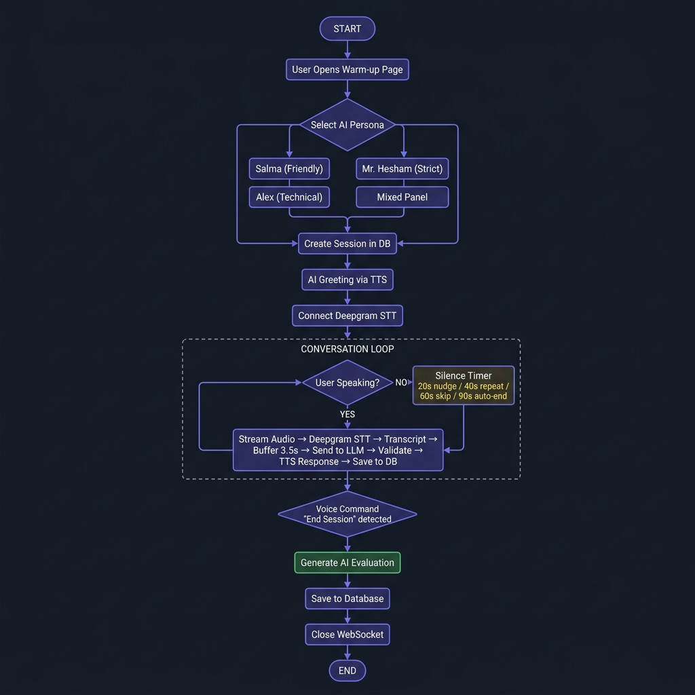
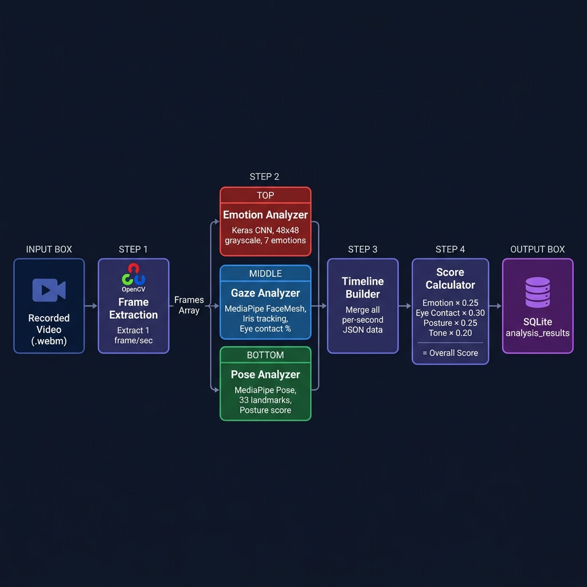
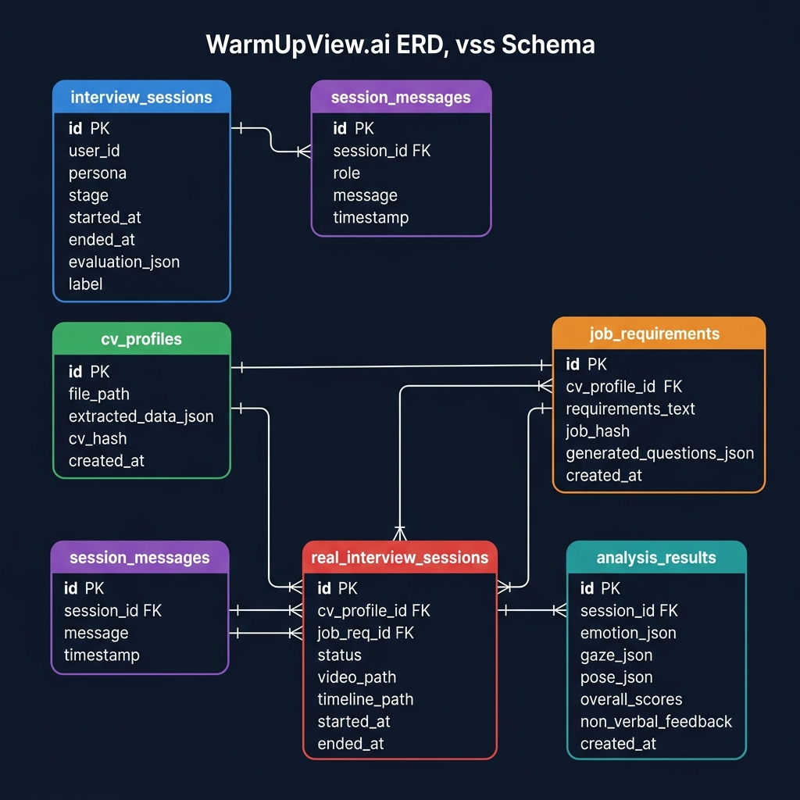
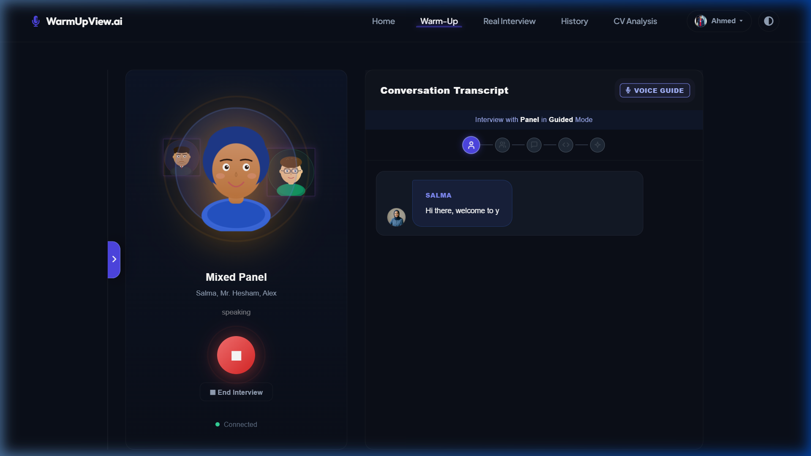
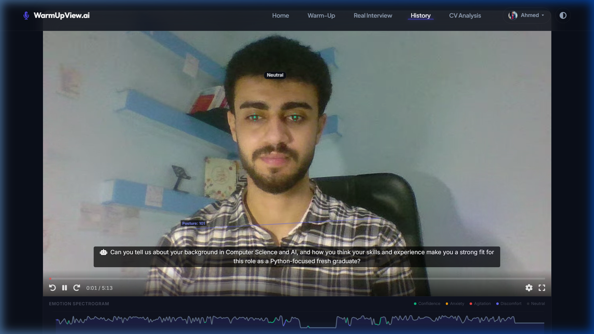
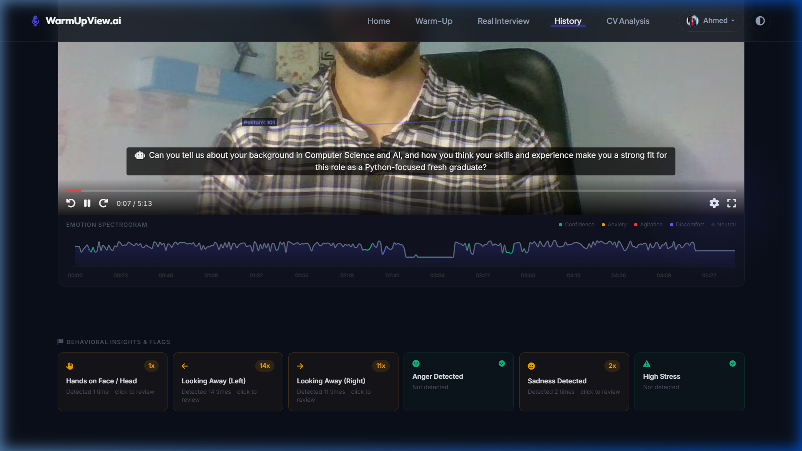
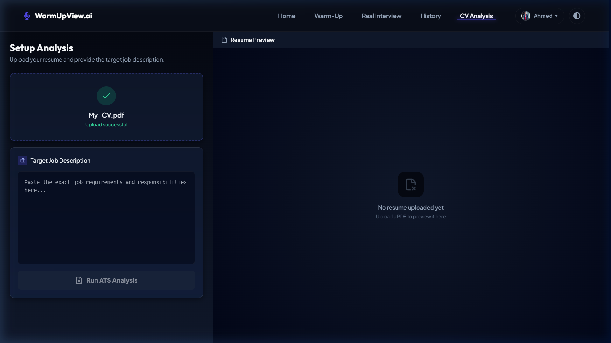

<div align="center">



# 🎙️ WarmUpView.ai

### AI-Powered Interview Preparation Platform

[](https://fastapi.tiangolo.com)
[](https://python.org)
[](https://aistudio.google.com)
[](https://groq.com)
[](https://mediapipe.dev)
[](https://sqlite.org)

> **Practice interviews with AI, get real-time multimodal feedback on your voice, emotions, eye contact, posture, and CV — all in your browser.**

[✨ Features](#-features) • [🏗 Architecture](#-architecture) • [📸 Screenshots](#-screenshots) • [⚙️ Installation](#️-installation) • [📊 Tech Stack](#-tech-stack) • [🗄️ Database](#️-database-schema)

</div>

---

## ✨ Features

| Module | Description |
|---|---|
| 🎙️ **Warm-up Simulator** | Voice-only practice with 4 AI personas, real-time STT/TTS, 5-stage interview flow |
| 🎥 **Real Interview Mode** | Webcam recording with Simli visual avatar, CV-tailored questions, live coding challenge, multimodal analysis |
| 📄 **CV Analyzer** | ATS scoring, skill gap detection, red-pen annotations, actionable roadmap |
| 📊 **Performance Report** | Emotion timeline, eye contact %, posture donut chart, voice tone, peak snapshots |
| 🗂️ **History Dashboard** | Track progress across sessions, filter by status, compare sessions |
| 🔐 **Auth System** | Secure login/signup with email + Google OAuth |

---

## 🏗 Architecture

### System Overview



The platform is built on a **FastAPI** backend with **WebSocket**-driven real-time communication, connected to multiple AI and external services along with a local ML pipeline for non-verbal analysis.

```
User Browser  ←──WebSocket / REST──→  FastAPI Backend  ←──→  Groq / Gemini / Deepgram
                                              │
                                    ┌─────────┴──────────┐
                                    │                    │
                              ElevenLabs TTS       Simli Avatar
                            (fallback: Edge-TTS)     (WebRTC)
                                    │
                          Analysis Worker (subprocess)
                                    │
                     ┌──────────────┼──────────────┐
                Keras CNN      MediaPipe        Librosa
               (Emotion)     (Gaze + Pose)     (Tone)
                                    │
                               SQLite DB
```

---

### 🔄 Warm-up Interview Flow



The warm-up module uses a **5-stage conversation engine**:

```
Stage 1: Warmup  →  Stage 2: Behavioral  →  Stage 3: Communication
                                          →  Stage 4: Technical
                                          →  Stage 5: Reflection
```

Each stage selects 2–3 random questions from a pool. The system detects voice commands (`"end session"`) and auto-advances stages when quotas are met. Silence is handled gracefully with progressive nudges at 20s, 40s, and 60s.

---

### 🤖 AI Services Routing

| Feature | Service | Model |
|---|---|---|
| Warm-up conversation | **Groq** | `llama-3.3-70b-versatile` |
| Warm-up evaluation | **Groq** | `llama-3.3-70b-versatile` |
| Question generation (Real Interview) | **Groq** | `llama-3.3-70b-versatile` |
| Coding challenge generation | **Groq** | `llama-3.3-70b-versatile` |
| Audio tone analysis (primary) | **Gemini** | `gemini-2.5-flash` (audio inline) |
| Audio tone analysis (fallback) | **Librosa** | Local — confidence + hesitation + pace |
| CV analysis & feedback | **Gemini** | `gemini-2.5-flash` |

**TTS Routing:**
| Module | Primary TTS | Fallback TTS |
|---|---|---|
| Warm-up Interview | Edge-TTS (Microsoft Neural Voices) | — |
| Real Interview | ElevenLabs (streaming PCM/MP3) | Edge-TTS |

---

### 📊 Analysis Pipeline



After a Real Interview is completed, a **background subprocess** performs 5 steps:

1. **Frame Extraction** — OpenCV extracts 1 frame/sec from the recorded video
2. **Parallel Analysis** — Three analyzers run simultaneously:
   - 🔴 **Emotion Analyzer** — Keras CNN (48×48 grayscale → 7 emotion classes)
   - 🔵 **Gaze Analyzer** — MediaPipe FaceMesh iris landmarks → eye contact boolean
   - 🟢 **Pose Analyzer** — MediaPipe Pose 33 landmarks → posture score
3. **Timeline Builder** — Merges per-second JSON data from all analyzers
4. **Peak Snapshot Extractor** — Saves key frames as JPEG
5. **Score Calculator** — Computes weighted overall score

#### Scoring Formula

```
Overall Score = (Emotion × 0.25) + (Eye Contact × 0.30) + (Posture × 0.25) + (Tone × 0.20)
```

With Coding Task:
```
Acceptance Rate = (Emotion × 0.20) + (Eye Contact × 0.25) + (Posture × 0.20) + (Tone × 0.15) + (Coding × 0.20)
```

---

## 🗄️ Database Schema



Seven core tables power the platform:

| Table | Purpose |
|---|---|
| `users` | User accounts (email + Google OAuth), admin flag |
| `interview_sessions` | Warm-up session records with evaluation JSON and score |
| `session_messages` | Per-turn conversation transcript |
| `cv_profiles` | Extracted CV data with hash-based deduplication |
| `job_requirements` | Job descriptions and cached AI-generated questions |
| `real_interview_sessions` | Full interview session with video/timeline paths and transcript |
| `analysis_results` | Multimodal scores: emotion, gaze, pose, tone, snapshots, transcript evaluation |

---

## 📸 Screenshots

<table>
  <tr>
    <td align="center"><b>Dashboard</b></td>
    <td align="center"><b>Login</b></td>
  </tr>
  <tr>
    <td></td>
    <td></td>
  </tr>
  <tr>
    <td align="center"><b>Persona Selection</b></td>
    <td align="center"><b>Live Warm-up Session</b></td>
  </tr>
  <tr>
    <td></td>
    <td></td>
  </tr>
  <tr>
    <td align="center"><b>Real Interview Setup</b></td>
    <td align="center"><b>Live Interview</b></td>
  </tr>
  <tr>
    <td></td>
    <td></td>
  </tr>
  <tr>
    <td align="center"><b>Performance Report (5 Rings)</b></td>
    <td align="center"><b>Video + Emotion Timeline</b></td>
  </tr>
  <tr>
    <td></td>
    <td></td>
  </tr>
  <tr>
    <td align="center"><b>CV Analysis</b></td>
    <td align="center"><b>Session History</b></td>
  </tr>
  <tr>
    <td></td>
    <td></td>
  </tr>
</table>

---

## 📊 Tech Stack

| Layer | Technology | Purpose |
|---|---|---|
| **Backend** | Python 3.10+, FastAPI 0.115.6, Uvicorn | API server, WebSocket handling |
| **Database** | SQLite, SQLAlchemy (async) + aiosqlite | Persistent data storage |
| **LLM (Primary)** | Groq — `llama-3.3-70b-versatile` | Fast inference for conversation & evaluation |
| **LLM (Secondary)** | Google Gemini 2.5 Flash | CV analysis, audio tone understanding |
| **Speech-to-Text** | Deepgram Nova-2 | Real-time streaming transcription |
| **Text-to-Speech (Primary)** | ElevenLabs API (streaming) | High-quality AI voice for real interviews |
| **Text-to-Speech (Fallback)** | Edge-TTS (Microsoft Neural Voices) | Free TTS for warm-up & fallback |
| **Visual Avatar** | Simli (WebRTC) | Animated visual avatar for real interviews |
| **Emotion Detection** | Keras CNN + ONNX Runtime | 7-class facial emotion classification |
| **Gaze Tracking** | MediaPipe FaceMesh | Iris landmark-based eye contact detection |
| **Pose Analysis** | MediaPipe Pose | 33-landmark body language scoring |
| **Audio Analysis** | Librosa (fallback) | Confidence, hesitation, pace metrics |
| **CV Parsing** | PyPDF | PDF text extraction |
| **Frontend** | Vanilla HTML/CSS/JS | Zero-framework responsive UI |
| **Code Editor** | Monaco Editor (CDN) | In-browser coding challenge environment |
| **Video** | Web MediaRecorder API, FFmpeg | WebM recording, audio mixing |
| **Auth** | Google OAuth + email/password, SessionMiddleware | User authentication |

---

## ⚙️ Installation

### Prerequisites

- Python 3.10+
- [Groq API Key](https://console.groq.com) — for LLM inference (conversation & evaluation)
- [Google Gemini API Key](https://aistudio.google.com) — for CV analysis & audio tone
- [Deepgram API Key](https://deepgram.com) — for real-time Speech-to-Text
- [ElevenLabs API Key](https://elevenlabs.io) — for high-quality TTS (optional, falls back to Edge-TTS)
- [Simli API Key](https://simli.com) — for visual avatar (optional)
- [Google OAuth Client ID](https://console.cloud.google.com) — for Google login (optional)

### 1. Clone the Repository

```bash
git clone https://github.com/abhbaty/WarmUpView.ai.git
cd WarmUpView.ai
```

### 2. Set Up Environment Variables

```bash
cd backend
# Create .env file with your API keys:
```

Required keys in `.env`:
```env
GROQ_API_KEYS=your_groq_key_here
GEMINI_API_KEYS=your_gemini_key_here
DEEPGRAM_API_KEY=your_deepgram_key_here

# Optional — enhances experience:
ELEVENLABS_API_KEYS=your_elevenlabs_key_here
ELEVENLABS_VOICE_ID=cjVigY5qzO86Hznl2qUK
SIMLI_API_KEYS=your_simli_key_here
SIMLI_FACE_ID=your_face_id_here
GOOGLE_CLIENT_ID=your_google_client_id_here
AUTH_SECRET_KEY=your_secret_key_here
```

### 3. Install Dependencies

```bash
cd backend
pip install -r requirements.txt
```

### 4. Run the Server

```bash
cd backend
uvicorn app.main:app --reload --port 8000
```

### 5. Open the App

Navigate to **http://localhost:8000** in your browser.

> **Note:** SQLite is used by default — the database tables are automatically created when the server starts for the first time. No manual database setup needed.

---

## 📁 Project Structure

```
WarmUpView.ai/
├── backend/
│   ├── app/
│   │   ├── main.py                     # FastAPI entry point, CORS, routers
│   │   ├── config.py                   # Settings & API keys from .env
│   │   ├── database.py                 # SQLAlchemy async engine & sessions
│   │   ├── models.py                   # ORM models (7 tables)
│   │   ├── warmup/                     # Warm-up interview module
│   │   │   ├── routes.py              # REST endpoints for sessions
│   │   │   └── websocket.py           # Real-time interview WS handler
│   │   ├── real_interview/             # Real interview module
│   │   │   ├── routes.py             # CV upload, sessions, reports, Simli, TTS
│   │   │   ├── websocket.py          # Live interview WS handler
│   │   │   ├── recorder_manager.py   # Storage directory management
│   │   │   ├── report_generator.py   # Report synthesis
│   │   │   └── validators.py         # Input validation
│   │   ├── analysis/                   # ML analysis pipeline
│   │   │   ├── analysis_worker.py    # Background subprocess runner
│   │   │   ├── emotion_analyzer.py   # Keras CNN — 7 emotions
│   │   │   ├── gaze_analyzer.py      # MediaPipe iris tracking
│   │   │   ├── pose_analyzer.py      # MediaPipe body landmarks
│   │   │   ├── video_processor.py    # OpenCV frame extraction
│   │   │   ├── timeline_builder.py   # Per-second data merge
│   │   │   ├── snapshot_extractor.py # Peak frame extraction
│   │   │   ├── transcript_evaluator.py # Transcript quality scoring
│   │   │   └── report_generator.py   # Gemini score synthesis
│   │   ├── services/                   # Shared service layer
│   │   │   ├── llm_service.py        # Groq LLM client (GroqLLM class)
│   │   │   ├── stt_service.py        # Deepgram STT integration
│   │   │   ├── tts_service.py        # Edge-TTS synthesis
│   │   │   ├── evaluation_service.py # Session evaluation logic
│   │   │   └── session_service.py    # Session CRUD operations
│   │   ├── core/                       # Core utilities
│   │   │   ├── question_engine.py    # Stage-based Q&A engine
│   │   │   ├── llm_health_manager.py # LLM health & rate limit tracking
│   │   │   ├── response_validator.py # AI response validation & repair
│   │   │   └── transcript_buffer.py  # Audio transcript buffering
│   │   ├── auth/                       # Authentication
│   │   │   ├── routes.py             # Login, signup, Google OAuth
│   │   │   └── deps.py              # Auth dependencies
│   │   └── admin/                      # Admin panel
│   │       └── routes.py             # User management endpoints
│   └── requirements.txt
├── frontend/
│   ├── index.html                      # Main dashboard
│   ├── admin.html                      # Admin panel
│   ├── profile.html                    # User profile
│   ├── auth/
│   │   ├── auth.html                  # Login & signup page
│   │   ├── auth.js                    # Auth logic
│   │   └── auth.css                   # Auth styles
│   ├── warmup/                         # Warm-up module
│   │   ├── interview.html             # Live warm-up interview page
│   │   ├── interview.js               # Interview logic & WebSocket
│   │   ├── session.html               # Session review page
│   │   ├── session.js                 # Session viewer logic
│   │   └── avatar.js                  # AI avatar animation & lip-sync
│   ├── real_interview/                 # Real interview module
│   │   ├── real_interview.html        # Live interview + Monaco editor
│   │   ├── real_interview.js          # Interview WS + recording logic
│   │   ├── report.html                # Multimodal analytics report
│   │   ├── report.js                  # Report rendering & charts
│   │   ├── history.html               # Session history with filters
│   │   └── history.js                 # Status polling & filter logic
│   ├── cv_analysis/
│   │   └── cv_analysis.html           # CV upload + ATS analysis viewer
│   ├── css/
│   │   ├── style.css                  # Global design system
│   │   ├── layout.css                 # Shared layout styles
│   │   └── home.css                   # Dashboard styles
│   ├── js/
│   │   ├── layout.js                  # Shared nav, theme toggle, auth guard
│   │   ├── app.js                     # Dashboard logic
│   │   ├── home.js                    # Home page logic
│   │   ├── admin.js                   # Admin panel logic
│   │   └── auth-guard.js             # Route protection
│   └── images/
├── docs/
│   ├── images/                         # Architecture diagrams
│   ├── screenshots/                    # UI screenshots
│   └── architecture.md                # Detailed architecture docs
└── README.md
```

---

## 🤝 AI Personas

The warm-up module features 4 distinct AI interviewer personas:

| Persona | Style | Focus |
|---|---|---|
| 👩 **Salma** | Friendly & Supportive | Confidence building, general questions |
| 👨‍💼 **Mr. Hesham** | Strict & Professional | Pressure handling, formal tone |
| 👨‍💻 **Alex** | Technical & Peer-like | Technical depth, problem solving |
| 👥 **Mixed Panel** | Combined voices | Comprehensive, realistic panel simulation |

---

## 📝 How It Works

### Warm-up Interview
1. Select your AI persona → Session created in DB
2. AI greets you via Edge-TTS + animated avatar lip-sync
3. Speak into microphone → streamed to Deepgram STT in real-time
4. Transcript buffered (3.5s silence threshold) → sent to Groq LLM
5. AI responds via TTS → saved to session transcript
6. Stage quota met → advance to next interview stage
7. Say **"End Session"** or complete all stages → Groq generates evaluation report

### Real Interview
1. Upload CV (PDF) → parsed by PyPDF, stored in DB
2. Paste job description → Groq generates 7 tailored questions
3. Interview begins: webcam records (WebM), Simli visual avatar presents, AI asks questions via ElevenLabs TTS
4. Optional: coding challenge in Monaco Editor with countdown timer
5. Session ends → video uploaded to server → analysis subprocess spawned
6. 5-step ML pipeline runs: frame extraction → 3 parallel analyzers → timeline → scoring
7. View comprehensive report: emotion spectrogram, eye contact %, posture chart, peak snapshots

---

<div align="center">

Built with ❤️ using FastAPI, Groq, Google Gemini, ElevenLabs, Deepgram, Simli & MediaPipe

**[⬆ Back to top](#%EF%B8%8F-warmupviewai)**

</div>
