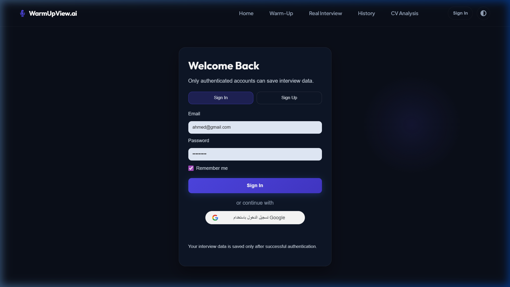
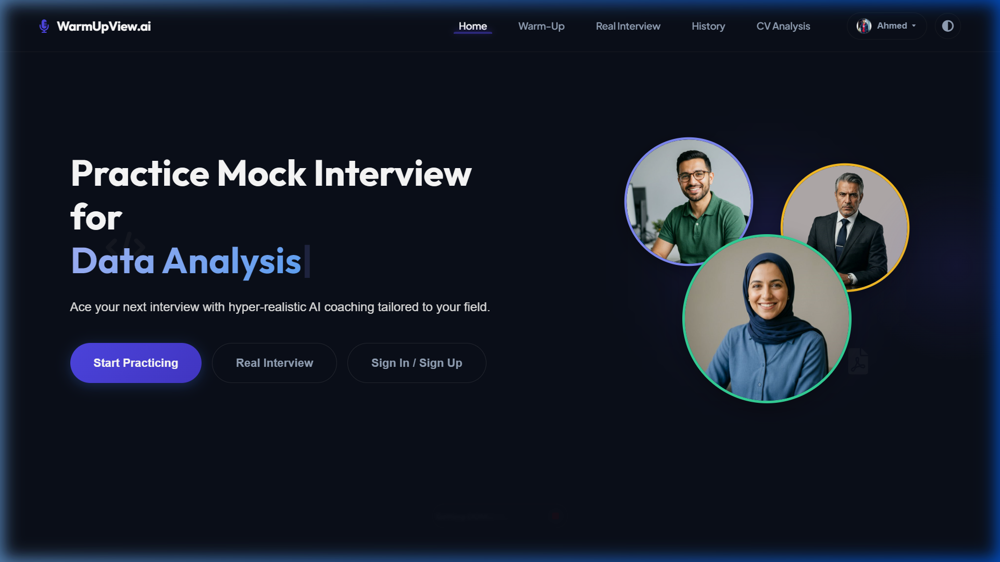
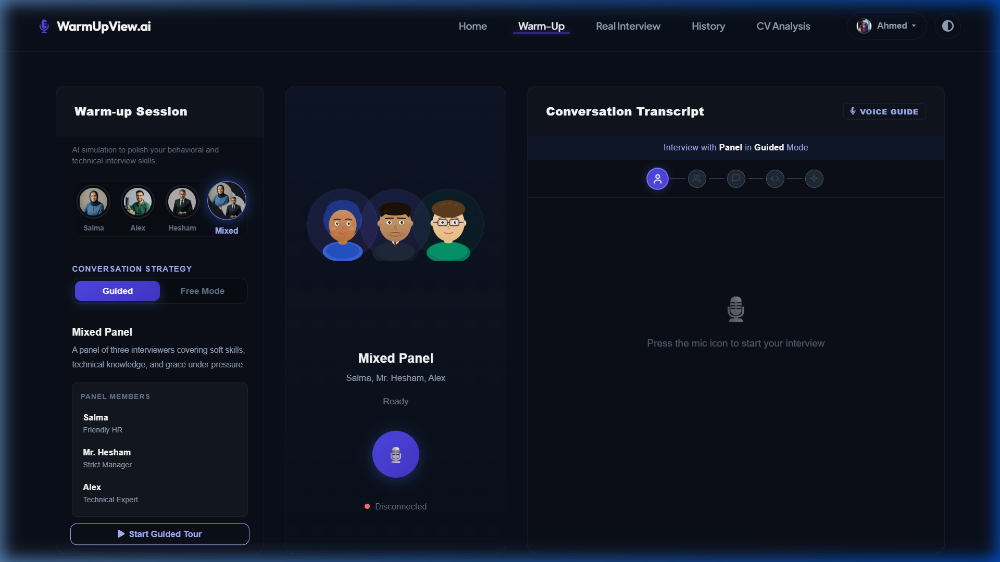
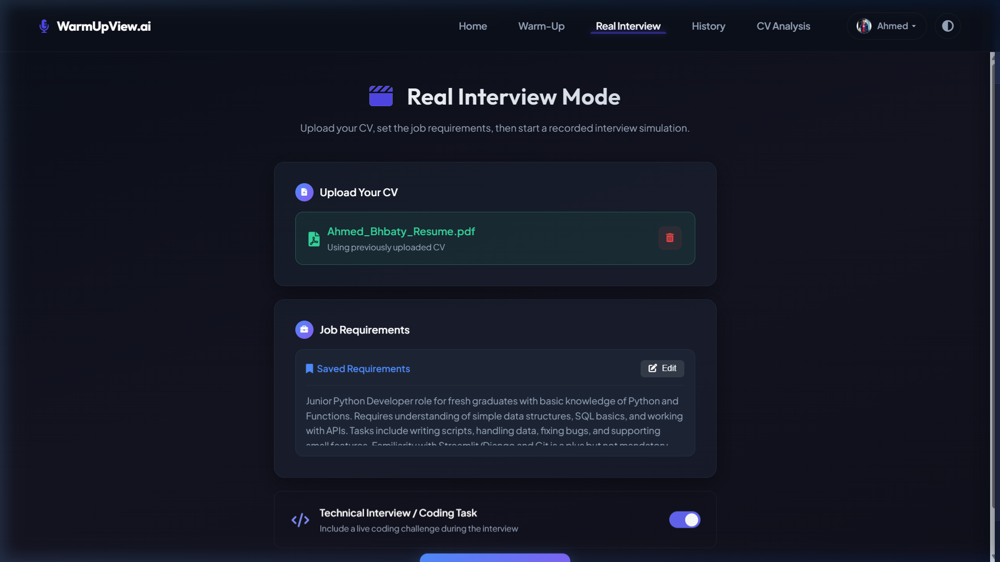
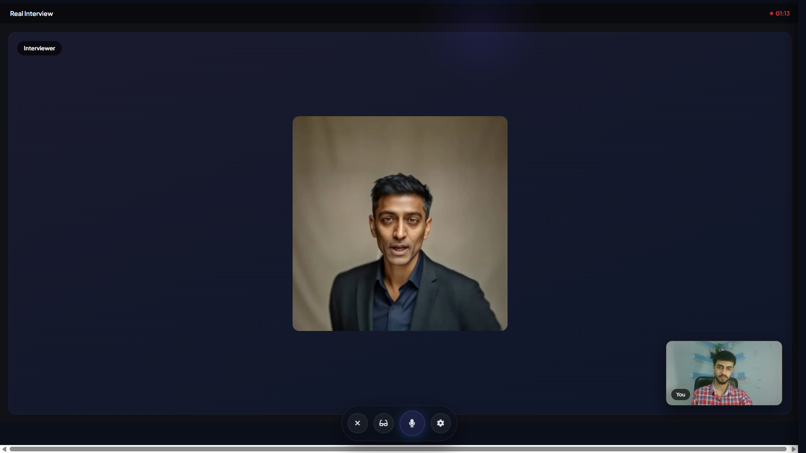
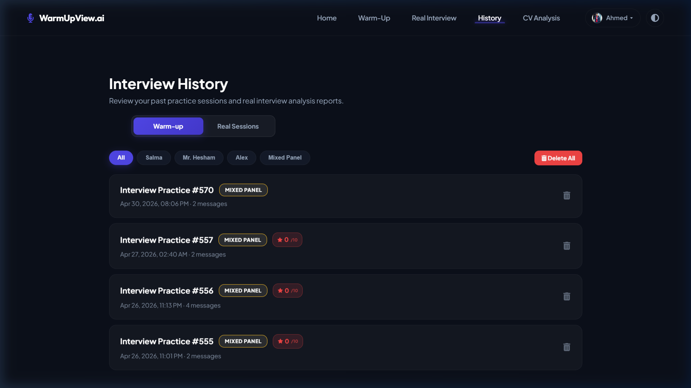

# WarmUpView 3rd - UI Documentation

This document outlines the complete user interface structure for the WarmUpView platform, detailing every screen from authentication to the final performance reports.

---

## 1. 🔐 Authentication & Onboarding

### 1.1. Login Page
The entry point for returning users. Features a clean, professional design with email and password fields.

*Figure 1: Login Page*

### 1.2. Sign Up Page
The registration page for new users to create their accounts.

*Figure 2: Sign Up Page*

---

## 2. 🏠 Main Dashboard (Lobby)

The central navigation hub where users select which module they want to practice.
- Features large, interactive cards/buttons for: Warm-up Interview, Real Interview, CV Analysis, and History.
- Displays user profile summary and quick stats.

*Figure 3: Main Dashboard (Dark Mode)*

*Figure 4: Main Dashboard (Light Mode)*

---

## 3. 🎙️ Warm-up Interview Simulator

A low-pressure environment for verbal practice without video recording.

### 3.1. Persona Selection
Users choose their AI interviewer based on the strictness and style they prefer (Friendly Salma, Strict Mr. Hesham, Technical Alex, or a Mixed Panel).

*Figure 5: Persona Selection Overview*

*Figure 6: Persona: Salma (Friendly)*

*Figure 7: Persona: Alex (Peer)*

*Figure 8: Persona: Mr. Hesham (Strict)*

*Figure 9: Persona: Mixed Panel*

### 3.2. Live Warm-up Session
The conversational interface featuring the animated AI avatar, a live audio visualizer/waveform, and real-time speech-to-text transcriptions.

*Figure 10: Warm-up Session (Initial)*

*Figure 11: Warm-up Session (Active)*

*Figure 12: Warm-up Session (Transcript View)*

*Figure 13: Warm-up Session (Conversation View)

---

## 4. 🧑💼 Real Interview Simulator

This module simulates a high-pressure interview environment. It consists of three main phases:

### 4.1. Setup Page (Pre-Interview)
Users upload their CV and provide the Job Description to generate tailored questions.

*Figure 14: Real Interview Setup*

*Figure 15: Real Interview Gateway*

### 4.2. Live Interview Phase (Recording & AI Conversation)
The core interview experience where the user is recorded via webcam. The AI interviewer delivers questions verbally, and the system records the user's audio and video for post-session analysis.

*Figure 16: Live Interview Phase*

### 4.3. Coding Challenge Phase (Coding Screen)
If a coding task is triggered, the interface transitions into a dedicated coding environment featuring a Monaco code editor, the problem instructions, and a live countdown timer.

*Figure 17: Coding Challenge Phase*

### 4.4. Analysis Processing
While the system processes the multimodal data, the user sees a real-time progress indicator.

*Figure 18: Analysis Processing*

---

## 5. 📄 CV Analysis Dashboard

The module dedicated to reviewing and improving the user's resume.

### 5.1. Setup & CV Preview
The interface where the user uploads their PDF, inputs the job description, and previews the document.

*Figure 19: CV Analysis Page(Light Mode)*

*Figure 20: CV Analysis Page(Dark Mode)*

*Figure 21: After upload the cv view

### 5.2. ATS Score & Detailed Breakdown
An overall ATS compatibility score, alongside detailed breakdowns of skills, experience, and education matches.

*Figure 22: Score Breakdown*

### 5.3. Gaps Analysis & Action Plan
Highlights critical skill and experience gaps, providing recommended steps and an actionable roadmap to improve the resume.

*Figure 23: Gaps Analysis*

*Figure 24: Action Plan*

### 5.4. Red-Pen Feedback & Annotations
The analysis view displaying surgical, hand-drawn style annotations (checkmarks, X-marks, and connectors) directly on the CV.

*Figure 25: CV Annotations Report*

---

## 6. 🗂️ History & Progress

The tracking dashboard where users can review all their past sessions and track improvement over time.
- A list/table of all past Warm-up and Real interviews.
- Status indicators (Completed, Failed, Processing).

*Figure 26: History Overview*

*Figure 27: Detailed History View*

---

## 7. 📊 Interview Performance Report

After completing a Real Interview, the system generates a comprehensive, multimodal performance report. This dashboard provides actionable feedback across various dimensions:

### 7.1. Video Playback & Emotion Timeline
The recorded interview video is presented alongside a synced timeline waveform that highlights the emotional state of the user throughout the session.

*Figure 28: Video Playback (Original)*

*Figure 29: Interview Video Report (Update)*

### 7.2. Performance Matrix (The 5 Rings)
A visual dashboard displaying the user's scores across five key metrics: Overall Acceptance Rate, Emotion, Eye Contact, Posture, and Voice Tone.

*Figure 30: Performance Matrix Overview*

### 7.3. Voice & Tone Analysis
A dedicated section detailing the acoustic features of the user's voice, including progress bars for Confidence, Fluency, and Pace.

*Figure 31: Voice and Tone Analysis*

### 7.4. Body Language & Posture Summary
A visual breakdown (Donut Chart) of the user's physical posture during the interview, showing the percentage of time spent in various states (e.g., Upright, Leaning, Hand on Head).

*Figure 32: Body Language & Pose Analysis*

### 7.5. Peak Moment Snapshots
Key visual frames extracted automatically from the video recording to highlight moments of significant emotional or postural shifts.

*Figure 33: Peak Moment Snapshots*

### 7.6. Non-Verbal AI Feedback
A text-based summary generated by the AI explaining the user's non-verbal communication patterns and providing tips for improvement.

*Figure 34: Interview Conversation Log*
