# WarmUpView.ai — System Diagrams for Report

> [!IMPORTANT]
> All diagrams below are based on the **actual implemented system**. You can recreate them in Canva/Draw.io, or screenshot the Mermaid renders directly.

---

## 1. Use Case Diagram (Chapter 3)

```mermaid
graph TB
    subgraph WarmUpView.ai System
        UC1["Start Warm-up Interview"]
        UC2["Select AI Persona"]
        UC3["Speak with AI Interviewer"]
        UC4["End Session via Voice Command"]
        UC5["View Warm-up Evaluation"]
        UC6["Upload CV"]
        UC7["Enter Job Requirements"]
        UC8["Start Real Interview"]
        UC9["Record Video During Interview"]
        UC10["Upload Video for Analysis"]
        UC11["View Analysis Report"]
        UC12["Analyze CV"]
        UC13["View Interview History"]
        UC14["Delete Past Session"]
    end

    User((User))
    Gemini[/"Google Gemini API"/]
    Deepgram[/"Deepgram STT API"/]
    EdgeTTS[/"Edge-TTS Service"/]
    CVEngine[/"CV Analysis Engine"/]

    User --> UC1
    User --> UC2
    User --> UC3
    User --> UC4
    User --> UC5
    User --> UC6
    User --> UC7
    User --> UC8
    User --> UC9
    User --> UC10
    User --> UC11
    User --> UC12
    User --> UC13
    User --> UC14

    UC3 --> Deepgram
    UC3 --> Gemini
    UC3 --> EdgeTTS
    UC5 --> Gemini
    UC7 --> Gemini
    UC8 --> Gemini
    UC10 --> CVEngine
    UC12 --> Gemini

    style User fill:#4f46e5,stroke:#fff,color:#fff
    style Gemini fill:#1e293b,stroke:#818cf8,color:#c7d2fe
    style Deepgram fill:#1e293b,stroke:#34d399,color:#a7f3d0
    style EdgeTTS fill:#1e293b,stroke:#fbbf24,color:#fde68a
    style CVEngine fill:#1e293b,stroke:#f87171,color:#fca5a5
```

---

## 2. Activity Diagram — Warm-up Interview (Chapter 3)

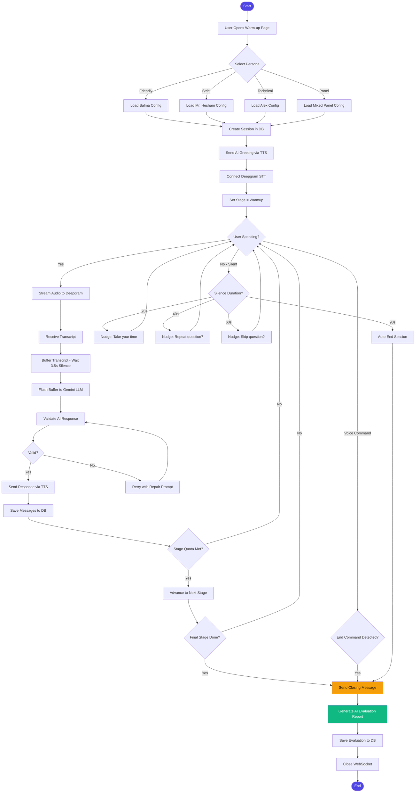

---

## 3. Activity Diagram — Real Interview (Chapter 3)

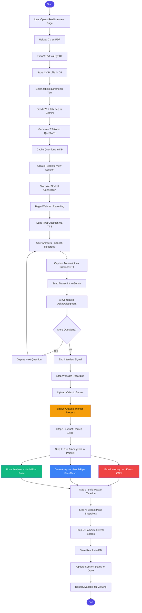

---

## 4. Sequence Diagram — Warm-up Interview Session (Chapter 3)

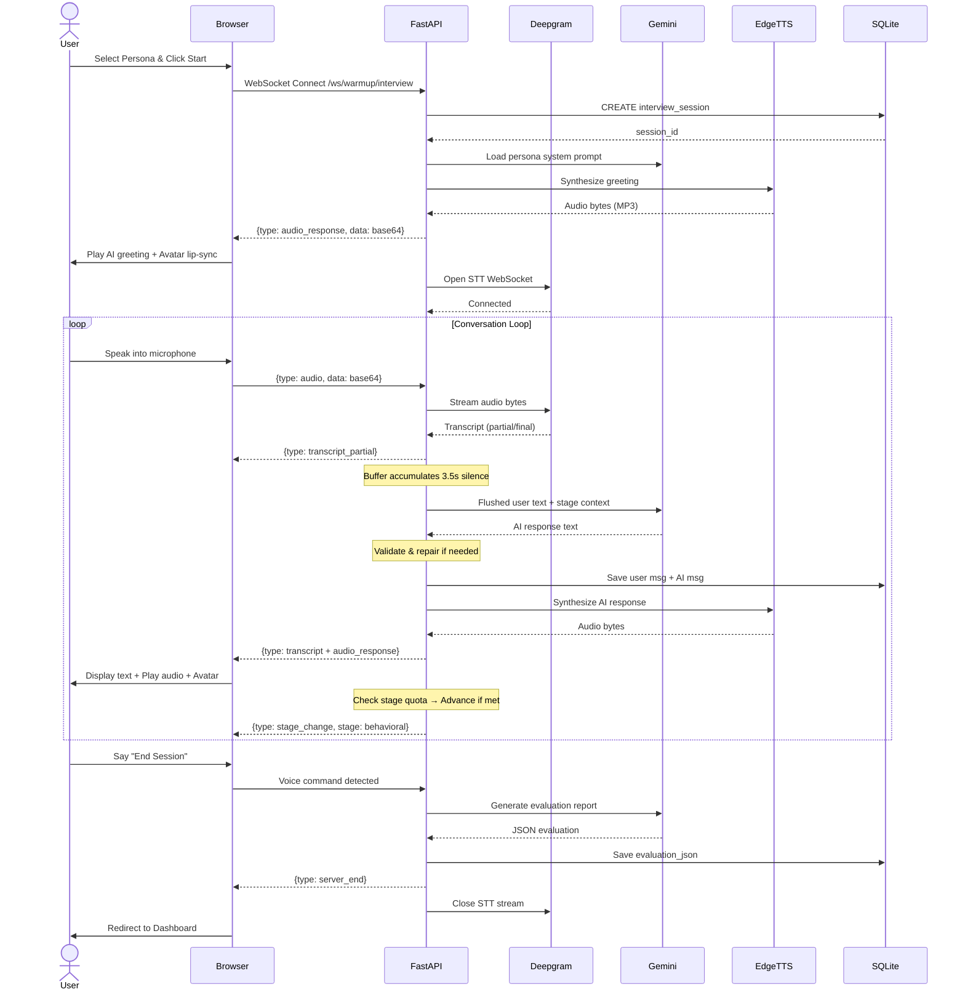

---

## 5. Sequence Diagram — Real Interview Session (Chapter 4)

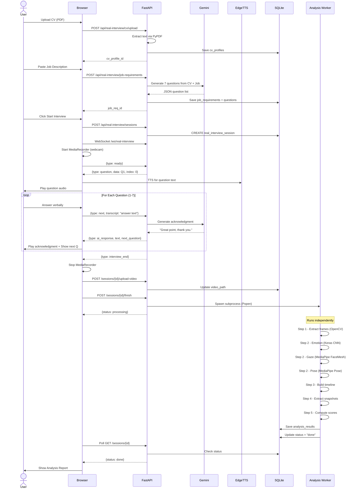

---

## 6. Data Flow Diagram — Level 0 (Context Diagram)

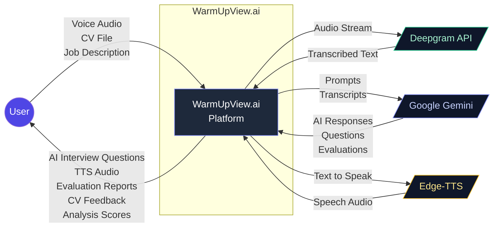

---

## 7. Data Flow Diagram — Level 1 (Detailed)

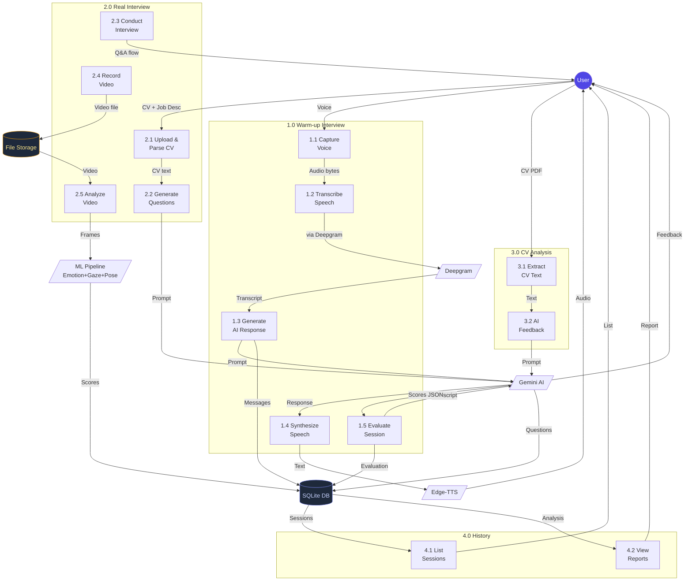

---

## 8. Entity Relationship Diagram — Database (Chapter 4)

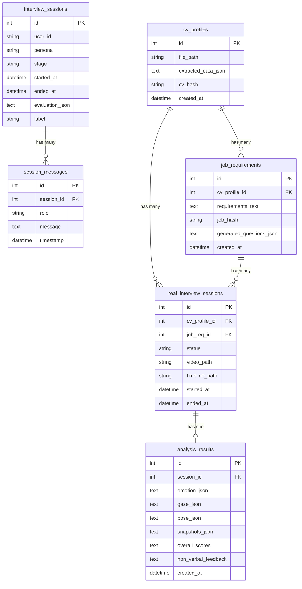

---

## 9. Analysis Pipeline Flow (Chapter 4)

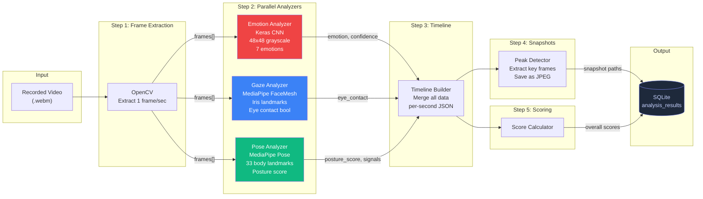

---

## 10. Overall Score Formula (Chapter 4)

The overall non-verbal performance score is computed as a weighted average of three components:

```
Overall Score = (Emotion Score × 0.3) + (Eye Contact Score × 0.4) + (Posture Score × 0.3)
```

Where:

| Component | Formula | Range |
|---|---|---|
| **Emotion Score** | `positive_frames / total_frames` | 0.0 – 1.0 |
| **Eye Contact Score** | `eye_contact_frames / total_frames` | 0.0 – 1.0 |
| **Posture Score** | `avg(posture_score per frame)` | 0.0 – 1.0 |

- **Positive emotions** = {happy, neutral, surprise}
- **Eye contact** = iris deviation < 0.06 (normalized)
- **Posture score** = `1.0 - (detected_signals × 0.2)` where signals include: hand_on_head, leaning_back, leaning_left/right, excessive_movement

---

## 11. Warm-up Evaluation Scoring (Chapter 4)

The AI evaluation uses Gemini to generate scores in a structured JSON format:

```
┌─────────────────────────────────────────────┐
│           AI Evaluation Report              │
├─────────────────────────────────────────────┤
│  overall_score        = avg(all scores)     │
│  communication_score  = 0–10                │
│  content_score        = 0–10                │
│  confidence_score     = 0–10                │
├─────────────────────────────────────────────┤
│  Performance Levels:                        │
│  0–3:   Poor                                │
│  3–5:   Developing                          │
│  5–7:   Good                                │
│  7–8.5: Strong                              │
│  8.5–10: Excellent                          │
├─────────────────────────────────────────────┤
│  evaluation_confidence: low/medium/high     │
│  key_insight: "one sentence summary"        │
│  strengths[]: specific positive points      │
│  improvements[]: max 2 actionable items     │
│  summary: balanced paragraph                │
└─────────────────────────────────────────────┘
```

**Fairness Rules:**
- Short session → lower confidence rating, NOT harsh scoring
- Struggling answers → partial credit
- Hesitation, filler words → NOT heavily penalized
- Sessions with < 10 total user words → automatic "too short" evaluation (no Gemini call)

---

## 12. Interview Stage Progression (Chapter 4)

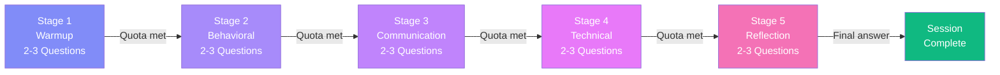

Each stage has a question pool (5–10 questions). The engine randomly selects 2–3 per stage, ensuring no repeats. In **Free Mode**, the user can manually switch stages.

---

## 13. AI Services Routing (Updated — Phase 2 Refactoring)

> [!IMPORTANT]
> After the Phase 2 refactoring, AI services are now split between **Groq** and **Gemini** based on the feature:

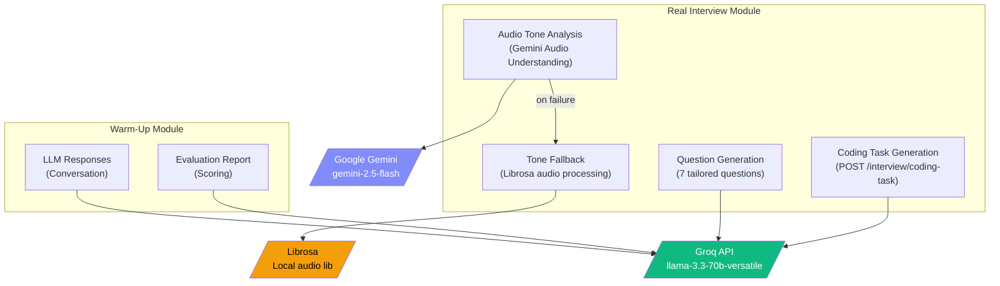

**Routing Logic:**
| Feature | Service | Model/Lib |
|---|---|---|
| Warm-up conversation | Groq | `llama-3.3-70b-versatile` |
| Warm-up evaluation | Groq | `llama-3.3-70b-versatile` |
| Real interview question generation | Groq | `llama-3.3-70b-versatile` |
| Coding challenge generation | Groq | `llama-3.3-70b-versatile` |
| Audio tone analysis (primary) | Gemini | `gemini-2.5-flash` (audio inline) |
| Audio tone analysis (fallback) | Librosa | Local — confidence + hesitation + pace |
| WebSocket real-time acknowledgment | **Unchanged** | (not modified) |

---

## 14. Audio Mixing Flow (New Feature)

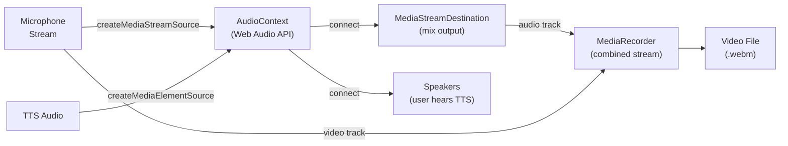

**Key Implementation Notes:**
- `createMediaElementSource()` can only be called **once** per element — stored as `ttsElSource`
- TTS is connected to **both** `audioCtx.destination` (speakers) and `mixDest` (recording)
- Combined stream = webcam video tracks + mixed audio tracks
- Fallback: if AudioContext fails → recording uses mic-only stream

---

## 15. Coding Task Feature Flow (New Feature)

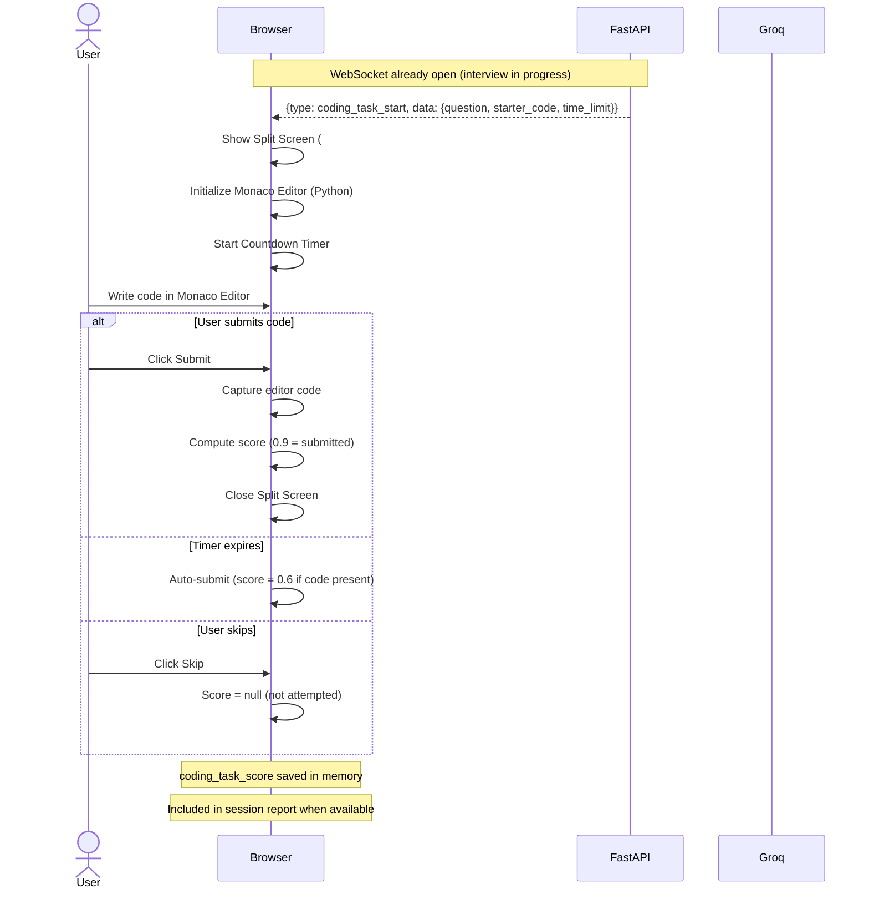

**Coding Task Scoring:**
| Scenario | Score |
|---|---|
| Submitted with code | 0.9 (90%) |
| Timed out with partial code | 0.6 (60%) |
| Timed out without code | 0.3 (30%) |
| Skipped | null (not shown in report) |

---

## 16. Updated Overall Score Formula (Phase 2)

The overall non-verbal performance score now includes **Tone Score**:

```
Overall Score = (Emotion × 0.25) + (Eye Contact × 0.30) + (Posture × 0.25) + (Tone × 0.20)
```

**Acceptance Rate** (shown in report dashboard):

**Without Coding Task:**
```
Acceptance Rate = Emotion(0.25) + Eye Contact(0.30) + Posture(0.25) + Tone(0.20)
```

**With Coding Task:**
```
Acceptance Rate = Emotion(0.20) + Eye Contact(0.25) + Posture(0.20) + Tone(0.15) + Coding(0.20)
```

| Component | Source | Range |
|---|---|---|
| Emotion Score | Keras CNN — % positive frames | 0.0 – 1.0 |
| Eye Contact Score | MediaPipe FaceMesh | 0.0 – 1.0 |
| Posture Score | MediaPipe Pose | 0.0 – 1.0 |
| Tone Score | Gemini/Librosa | confidence×0.6 + (1-hesitation)×0.4 |
| Coding Score | Frontend scoring | 0.3 / 0.6 / 0.9 |

---

## 17. MediaPipe Pose Skeleton Overlay Flow

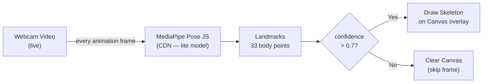

**Canvas Connections Drawn:**
- Shoulders (11↔12), Arms (11→13→15, 12→14→16)
- Torso (11→23, 12→24, 23↔24)
- Legs (23→25→27, 24→26→28)
- Color: `rgba(99, 102, 241, 0.7)` — indigo/violet dots & lines

---

> [!TIP]
> **How to use these diagrams:**
> 1. **For Canva/Draw.io:** Use these as blueprints — recreate them visually with prettier icons and colors
> 2. **For direct use:** If your report supports Mermaid, paste the code blocks directly
> 3. **For screenshots:** Open in a Mermaid viewer (GitHub, Notion, VS Code + Mermaid extension)

> [!IMPORTANT]
> **Key diagrams for your report chapters:**
> - Chapter 3: Use Case (#1), Activity Diagrams (#2, #3), Sequence Diagrams (#4, #5)
> - Chapter 4: ER Diagram (#8), Analysis Pipeline (#9), Score Formulas (#10, #11, #16), DFD (#6, #7), Stage Progression (#12)
> - **Phase 2 Updates:** AI Routing (#13), Audio Mixing (#14), Coding Task (#15), Pose Skeleton (#17)
